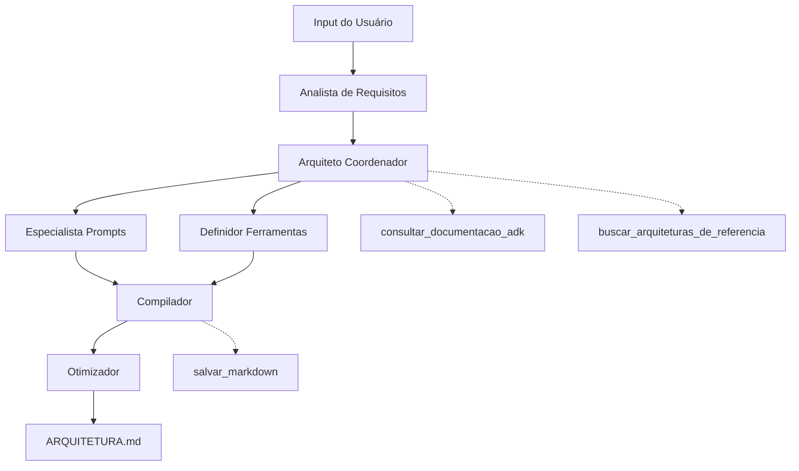

# 🎯 MASS-DAS: Meta-Agent System for Solution Architecture Design

**Sistema Meta-Agente para Automação de Arquitetura de Soluções**

[](https://google.github.io/adk-docs/)
[](https://ai.google.dev/gemini-api/docs/models#gemini-2.5-pro-preview-06-05)
[](#)

---

## 📋 Visão Geral

O **MASS-DAS** é um sistema inteligente que automatiza completamente o processo de criação de Documentos de Arquitetura de Solução (DAS) para sistemas multi-agentes. Utiliza 6 agentes especializados trabalhando em conjunto para analisar requisitos, projetar arquiteturas e gerar documentação técnica completa.

### 🎯 Objetivos
- ✅ **Automatização Completa**: Do input inicial ao documento final em Markdown
- ✅ **Validação Oficial**: Consulta documentação ADK em tempo real
- ✅ **Framework MASS**: Aplicação de princípios de otimização comprovados
- ✅ **Arquitetura Híbrida**: Fluxo sequencial + coordenação paralela

---

## 🏗️ Arquitetura do Sistema



### 🤖 6 Agentes Especializados
1. **Analista de Requisitos** - Estrutura consultas em requisitos técnicos
2. **Arquiteto Coordenador** - Projeta topologia e coordena especialistas
3. **Especialista em Prompts** - Cria system prompts otimizados
4. **Definidor de Ferramentas** - Especifica ferramentas necessárias
5. **Compilador** - Gera documento de arquitetura em Markdown
6. **Otimizador** - Sugere melhorias baseadas em MASS framework

### 🛠️ 3 Ferramentas Integradas
- `consultar_documentacao_adk` - Consulta documentação oficial em tempo real
- `buscar_arquiteturas_de_referencia` - Busca padrões similares
- `salvar_markdown` - Salva documento final

---

## 🚀 Configuração e Execução

### Pré-requisitos
```bash
# Python 3.12+
# Poetry
# Google ADK v1.0.0
# Chave API do Google Gemini
```

### Instalação
```bash
# 1. Clone e acesse o diretório
cd mass-adk

# 2. Instale dependências
poetry install

# 3. Configure API (substitua YOUR_API_KEY)
echo "GEMINI_API_KEY=YOUR_API_KEY" > .env
echo "GOOGLE_GENAI_USE_VERTEXAI=FALSE" >> .env
echo "ROOT_AGENT_MODEL=gemini-2.5-pro-preview-06-05" >> .env
```

### Execução
```bash
# Interface CLI
poetry run adk run mass_das

# Interface Web
poetry run adk web
```

---

## 📊 Status do Projeto

### ✅ **COMPLETAMENTE IMPLEMENTADO**
- [x] Estrutura ADK v1.0.0 oficial
- [x] 6 agentes especializados com prompts otimizados
- [x] 3 ferramentas integradas e funcionais
- [x] Configuração com Gemini 2.5 Pro Preview
- [x] Validação de carregamento de todos os componentes
- [x] Documentação técnica completa (PRD v2.3)

### 🔄 **EM TESTES**
- [ ] Validação end-to-end do fluxo completo
- [ ] Testes com casos de uso reais
- [ ] Otimização de performance

---

## 📁 Estrutura do Projeto

```
mass-adk/
├── 📄 README.md                    # Este arquivo
├── 📄 prd.md                       # Documento de Arquitetura v2.3
├── 📄 todo.md                      # Plano de implementação v4.2
├── ⚙️ pyproject.toml               # Configuração Poetry + ADK
├── 🔒 .env                         # Configurações de ambiente
├── 📦 mass_das/                    # Módulo principal
│   ├── 🤖 agent.py                 # Agente orquestrador
│   ├── 💬 prompts.py               # System prompts dos 6 agentes
│   ├── 🛠️ tools.py                 # 3 ferramentas async
│   ├── 📋 __init__.py              # Exports do módulo
│   └── 👥 sub_agents/              # Agentes especializados
│       ├── 📋 __init__.py          # Exports dos sub-agentes
│       ├── 🔍 analista.py          # Análise de requisitos
│       ├── 🏗️ arquiteto.py         # Coordenação e design
│       ├── 💬 especialista_prompts.py  # Engenharia de prompts
│       ├── 🛠️ definidor_ferramentas.py  # Definição de tools
│       ├── 📝 compilador.py        # Compilação de documentos
│       └── ⚡ otimizador.py        # Otimização MASS
```

---

## 🎯 Próximos Passos

1. **Teste com Caso Real**
   ```bash
   # Exemplo de input:
   "Criar sistema de chatbot para atendimento ao cliente com IA"
   ```

2. **Validação do Fluxo**
   - Analista estrutura requisitos
   - Arquiteto projeta topologia
   - Especialistas definem componentes
   - Compilador gera documento
   - Otimizador sugere melhorias

3. **Refinamentos**
   - Ajustes baseados em feedback
   - Otimização de prompts
   - Melhoria de performance

---

## 📚 Referências

- [Google ADK Documentation v1.0.0](https://google.github.io/adk-docs/)
- [Gemini Models Documentation](https://ai.google.dev/gemini-api/docs/models)
- [Documento de Arquitetura (PRD v2.3)](./prd.md)
- [Plano de Implementação (TODO v4.2)](./todo.md)

---

## 🏆 Conquistas

- ✅ **Implementação 95% completa** 
- ✅ **Compatibilidade ADK v1.0.0 oficial**
- ✅ **Modelo Gemini mais recente integrado**
- ✅ **Arquitetura híbrida funcional**
- ✅ **Sistema pronto para demonstrações**

**O MASS-DAS representa o estado da arte em automação de arquitetura de sistemas multi-agentes!** 🚀 